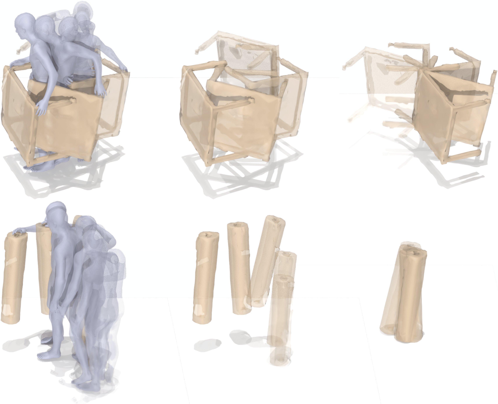
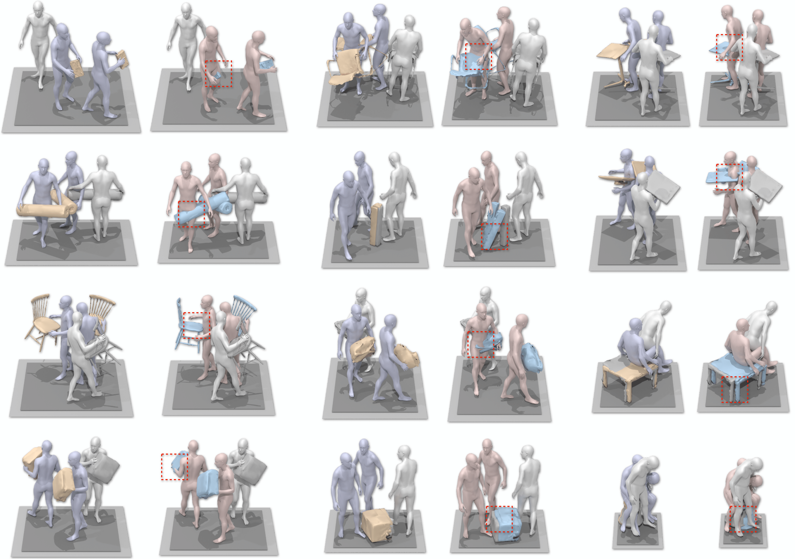

<br>
<p align="center">
<strong>InterDiff: Generating 3D Human-Object Interactions with Physics-Informed Diffusion</strong></h1>
  <p align="center">
    <a href='https://sirui-xu.github.io/' target='_blank'>Sirui Xu</a>&emsp;
    <a href='' target='_blank'>Zhengyuan Li</a>&emsp;
    <a href='https://yxw.web.illinois.edu/' target='_blank'>Yu-Xiong Wang*</a>&emsp;
    <a href='https://cs.illinois.edu/about/people/faculty/lgui' target='_blank'>Liang-Yan Gui*</a>&emsp;
    <br>
    University of Illinois Urbana-Champaign
    <br>
    ICCV 2023
  </p>
</p>

<p align="center">
  <a href="http://arxiv.org/abs/2308.16905" target='_blank'>
    
  </a> 
  <a href="https://arxiv.org/pdf/2308.16905.pdf" target='_blank'>
    
  </a> 
  <a href="https://sirui-xu.github.io/InterDiff/" target='_blank'>
    
  </a>
  <a href="" target='_blank'>
    
  </a>
</p>

## 🏠 About
<div style="text-align: center;">
    
</div>
This paper addresses a novel task of anticipating 3D human-object interactions (HOIs). Most existing research on HOI synthesis lacks comprehensive whole-body interactions with dynamic objects, e.g., often limited to manipulating small or static objects. Our task is significantly more challenging, as it requires <b>modeling dynamic objects with various shapes</b>, <b>capturing whole-body motion</b>, and <b>ensuring physically valid interactions</b>. To this end, we propose InterDiff, a framework comprising two key steps: (i) interaction diffusion, where we leverage a diffusion model to encode the distribution of future human-object interactions; (ii) interaction correction, where we introduce a physics-informed predictor to correct denoised HOIs in a diffusion step. Our key insight is to <b>inject prior knowledge</b> that the <b>interactions under reference with respect to contact points</b> follow a simple pattern and are easily predictable. Experiments on multiple human-object interaction datasets demonstrate the effectiveness of our method for this task, capable of producing realistic, vivid, and remarkably long-term 3D HOI predictions.

## 🔥 News
- [2023-09-01] Our paper is available on the [Arxiv](https://arxiv.org/pdf/2308.16905) &#x1F389;

## 🔍 Overview

### 💡 Key Insight
<p align="center">
  
</p>
We present ground truth HOI sequences (<b>left</b>), object motions (<b>middle</b>), and objects relative to the contacts after coordinate transformations (<b>right</b>). Our key insight is to inject coordinate transformations into a diffusion model, as the relative motion shows simpler patterns that are easier to predict, e.g., rotating around a fixed axis (<b>top</b>) or being almost stationary (<b>bottom</b>).

### 🧪 Experimental Results

#### Qualitative Comparisons with Pure Diffusion
<p align="center">
  
</p>


## 📝 TODO List
- [ ] Release more demos.
- [ ] Release training and evaluation code.
- [ ] Release code for visualization.

## 🔗 Citation

If you find our work helpful, please cite:

```bibtex
@inproceedings{
   xu2023interdiff,
   title={{InterDiff}: Generating 3D Human-Object Interactions with Physics-Informed Diffusion},
   author={Xu, Sirui and Li, Zhengyuan and Wang, Yu-Xiong and Gui, Liang-Yan},
   booktitle={ICCV},
   year={2023},
}
```


## 👏 Acknowledgements
- [BEHAVE](https://virtualhumans.mpi-inf.mpg.de/behave/): We use the BEHAVE dataset for the mesh-based interaction.
- [HO-GCN](https://hiwilliamwwl.github.io/Learn-to-Predict-How-Humans-Manipulate-Large-Sized-Objects-From-Interactive-Motions-objects/): We use the presented dataset for the skeleton-based interaction.
- [TEMOS](https://github.com/Mathux/TEMOS): We adopt the rendering code for HOI visualization.
- [MDM](https://guytevet.github.io/mdm-page/): We use the MDM as the main framework.